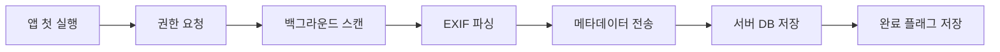

# 📸 갤러리 동기화 전략 (MVP)

## 🎯 최종 결정 사항

### 문제 인식
1. **매번 로컬 EXIF 파싱**: 느림 (10-30초)
2. **랜덤 사진 추천**: 회상 치료 효과 감소
3. **중복 파싱**: 배터리/CPU 낭비

### 해결책: 하이브리드 방식

| 구분 | 데이터 | 저장 위치 |
|------|--------|----------|
| **사진 원본** | 고해상도 이미지 (MB 단위) | 📱 클라이언트 로컬 |
| **메타데이터** | 날짜, 위치, EXIF (KB 단위) | ☁️ 서버 DB |
| **대화 정보** | ai_analysis, view_count | ☁️ 서버 DB |

---

## 🔄 동기화 흐름

### 1단계: 초기 갤러리 스캔 (앱 설치 후 1회)



**클라이언트 코드:**
```javascript
// mobile-app/src/utils/gallerySync.js 참조
import { syncGalleryMetadata } from './utils/gallerySync';

// 앱 시작 시 실행
useEffect(() => {
  const initGallery = async () => {
    const { completed } = await checkSyncStatus();
    
    if (!completed) {
      // 백그라운드에서 동기화
      await syncGalleryMetadata(kakaoId);
    }
  };
  
  initGallery();
}, []);
```

**서버 저장 데이터:**
```json
{
  "id": "uuid",
  "user_id": "uuid",
  "local_uri": "file:///storage/emulated/0/DCIM/...",
  "taken_at": "2010-05-15T10:30:00",
  "location_name": "부산 해운대",
  "latitude": 35.1587,
  "longitude": 129.1603,
  "view_count": 0,
  "ai_analysis": null  // 대화 후 업데이트
}
```

### 2단계: 사진 선택 (빠름, <1초)

**서버가 알고리즘으로 추천:**
```python
# 오래된 + 덜 본 사진 우선
SELECT * FROM user_photos
WHERE user_id = ?
ORDER BY 
  taken_at ASC,        # 오래된 사진
  view_count ASC,      # 덜 본 사진
  RANDOM()
LIMIT 6;
```

**클라이언트:**
```javascript
// GalleryScreen.js
const fetchRandomPhotos = async () => {
  const response = await axios.get(
    `${API_BASE_URL}/photos/random?kakao_id=${kakaoId}&limit=6`
  );
  
  // local_uri로 로컬 이미지 표시
  setPhotos(response.data);
};
```

### 3단계: 연관 사진 추천 (의미있음)

**날짜 기반 추천 (±7일):**
```python
# 같은 시기 사진 추천
SELECT * FROM user_photos
WHERE user_id = ?
  AND taken_at BETWEEN (? - INTERVAL '7 days') AND (? + INTERVAL '7 days')
  AND id != ?
ORDER BY ABS(EXTRACT(EPOCH FROM taken_at) - EXTRACT(EPOCH FROM ?))
LIMIT 6;
```

---

## 📊 성능 비교

### 제안 방식 (매번 로컬 파싱)

| 작업 | 시간 | 비고 |
|------|------|------|
| 사진 선택 | 10-30초 | EXIF 파싱 |
| 연관 추천 | 15-40초 | 전체 스캔 필요 |
| 배터리 소모 | 높음 | 매번 파싱 |

### 개선안 (서버 DB 활용)

| 작업 | 시간 | 비고 |
|------|------|------|
| 초기 스캔 | 30-60초 | 1회만 (백그라운드) |
| 사진 선택 | <1초 | DB 쿼리 |
| 연관 추천 | <1초 | 날짜 인덱스 활용 |
| 배터리 소모 | 낮음 | 1회 스캔 후 재사용 |

---

## 🎨 UX 시나리오

### Case 1: 첫 사용자

```
[앱 실행]
  ↓
"복실이가 할머니 사진을 보고 있어요..." (로딩)
  ↓
[백그라운드 스캔 30-60초]
  ↓
"준비 완료! 사진 보러 갈까요?"
  ↓
[사진 선택 화면 즉시 표시]
```

### Case 2: 재방문 사용자

```
[앱 실행]
  ↓
[즉시 메인 화면]
  ↓
[사진 보러 가기 클릭]
  ↓
[1초 이내 6장 표시]
```

### Case 3: 대화 중 연관 사진

```
[사진 A 선택: 2010년 해운대 바다]
  ↓
[대화 3턴 진행]
  ↓
"이 때 다른 사진도 보실래요?"
  ↓
[같은 날짜 사진 6장 추천]
  - 2010-05-15 바닷가 (같은 날)
  - 2010-05-14 회센터 (하루 전)
  - 2010-05-16 식당 (하루 후)
```

---

## 🔧 추가 구현 사항

### 1. 재동기화 기능 (설정 화면)

사용자가 새 사진을 추가한 경우:

```javascript
// 설정 화면에서 "사진 다시 불러오기" 버튼
const handleResync = async () => {
  Alert.alert(
    '사진 다시 불러오기',
    '갤러리의 새 사진을 가져올까요?',
    [
      { text: '취소', style: 'cancel' },
      { 
        text: '네', 
        onPress: async () => {
          await resyncGallery(kakaoId);
          Alert.alert('완료', '새 사진이 추가되었습니다!');
        }
      },
    ]
  );
};
```

### 2. 동기화 진행 표시

```javascript
// 백그라운드 작업 + 프로그레스 바
const [syncProgress, setSyncProgress] = useState(0);

const syncWithProgress = async () => {
  const totalPhotos = 1000;  // 예상 개수
  
  for (let i = 0; i < totalPhotos; i += 100) {
    // 배치 전송
    await sendBatch(photos.slice(i, i + 100));
    setSyncProgress((i / totalPhotos) * 100);
  }
};
```

### 3. 오프라인 모드

```javascript
// 네트워크 없을 때 로컬만 사용
import NetInfo from '@react-native-community/netinfo';

const fetchPhotos = async () => {
  const isConnected = await NetInfo.fetch();
  
  if (isConnected) {
    // 서버에서 추천 사진 가져오기
    return await fetchFromServer();
  } else {
    // 로컬 랜덤 선택
    return await fetchFromLocal();
  }
};
```

---

## ✅ MVP 체크리스트

### 필수 기능
- [x] 초기 갤러리 스캔 (1회)
- [x] 메타데이터 서버 저장
- [x] 빠른 사진 선택 (<1초)
- [x] 날짜 기반 연관 추천

### 선택 기능 (추후)
- [ ] 장소 기반 추천
- [ ] 얼굴 인식 기반 추천
- [ ] 자동 재동기화 (주기적)
- [ ] 증분 업데이트 (새 사진만)

---

## 🐛 예상 문제 및 해결

### Q1: 초기 스캔이 너무 오래 걸려요

**A:** 배치 처리로 개선
```javascript
// 100장씩 나눠서 전송
const BATCH_SIZE = 100;
for (let i = 0; i < photos.length; i += BATCH_SIZE) {
  await sendBatch(photos.slice(i, i + BATCH_SIZE));
}
```

### Q2: 사용자가 사진을 삭제했는데 서버에 남아있어요

**A:** 클라이언트에서 404 처리
```javascript
const photo = photos.find(p => p.local_uri === uri);
if (!await fileExists(photo.local_uri)) {
  // 서버에 삭제 요청
  await axios.delete(`/photos/${photo.id}`);
}
```

### Q3: 메타데이터만으로 충분한가요?

**A:** MVP에서는 충분. 추후 확장 가능:
- 썸네일 생성 (서버)
- Vision AI 분석 (대화 시)
- 얼굴 인식 (추후)

---

## 📝 정리

### 최종 전략: 하이브리드 방식

1. **초기 1회 스캔**: 백그라운드, 메타데이터만
2. **사진 원본**: 클라이언트 로컬 유지
3. **추천 알고리즘**: 서버에서 처리 (빠름, 의미있음)
4. **대화 정보**: 서버에 누적 저장

### 장점
✅ 빠른 사진 선택 (<1초)
✅ 의미있는 추천 (날짜/장소 기반)
✅ 배터리 효율적 (1회 스캔)
✅ 스토리지 효율적 (메타만 서버)
✅ 회상 치료 효과 증대

### 단점 (수용 가능)
⚠️ 초기 스캔 시간 (30-60초, 1회만)
⚠️ 네트워크 필요 (오프라인 모드로 대응)

---

**의견 주신 내용을 기반으로 개선된 방식입니다. 추가 질문이나 수정사항이 있으면 말씀해주세요!**
